# Timer App

A simple and intuitive Timer App built using **React Native**. This app allows users to start, pause, and reset timers with real-time updates and alerts.

## Features
- **Start, Pause, and Reset Timers**: Users can control the timers with simple button actions.
- **Real-time Countdown**: Displays the remaining time dynamically.
- **Progress Indicator**: Visual progress representation using `TimerProgress`.
- **Alert Notification**: Alerts users when half of the timer duration has passed.
- **Dark Mode Support**: Adapts UI elements for dark mode.
- **Persistent Timer History**: Stores completed timers using `AsyncStorage`.
- **Color-coded Status**:
  - Running: **Red**
  - Completed: **Green**
  - Paused: **Adaptive** (Dark mode supported)

## Installation
### Prerequisites
- [Node.js](https://nodejs.org/) installed
- [Expo CLI](https://docs.expo.dev/) installed globally

### Steps
1. Clone the repository:
   ```sh
   git clone https://github.com/Rohitkr321/Timer-Record-App
   cd timer-app
   ```
2. Install dependencies:
   ```sh
   npm install
   ```
3. Start the development server:
   ```sh
   expo start
   ```

## Usage
- Click the **Play** button to start the timer.
- Click the **Pause** button to stop the timer temporarily.
- Click the **Reset** button to reset the timer to its original duration.
- If the timer reaches halfway, an alert notification will appear.
- When the timer completes, it gets stored in history.

## Project Structure
```
TimerApp/
│-- components/
│   ├── TimerItem.js    # Individual Timer component
│   ├── TimerProgress.js # Progress Indicator
│-- screens/
│   ├── HomeScreen.js    # Main Screen with timers
│   ├── HistoryScreen.js # Displays previously completed timers
│   ├── AddTimerScreen.js # Screen to create and configure new timers
│-- assets/              # Static assets
│-- App.js               # Entry point
│-- README.md            # Project documentation
```

## Screens
### HistoryScreen
The **HistoryScreen** allows users to view previously completed timers. It fetches stored timers from `AsyncStorage` and displays them in a list format. Users can track their past timer sessions easily.

### AddTimerScreen
The **AddTimerScreen** provides an interface for users to create and configure new timers. Users can set a duration, customize the timer name, and start tracking time immediately.

## Dependencies
- `react-native` - Core framework
- `expo` - Development tool for React Native
- `@react-native-async-storage/async-storage` - Persistent storage
- `react-native-modal` - For pop-up dialogs
- `react-native-vector-icons/Ionicons` - Icon support

## Dark Mode Implementation
Dark mode is automatically applied based on system settings. It adapts UI elements accordingly:
- **Text Colors**: `statusText` dynamically changes for better visibility.
- **Backgrounds**: Containers adjust for dark mode aesthetics.
- **Status Colors**: "Running" stays red, "Completed" stays green, and "Paused" adapts to dark mode.

---
**Author:** Rohit Kumar
🚀 Built with ❤️ using React Native

## Some Screenshots Of TimerApp

### Home Screen Light Mode
<p align="center">
  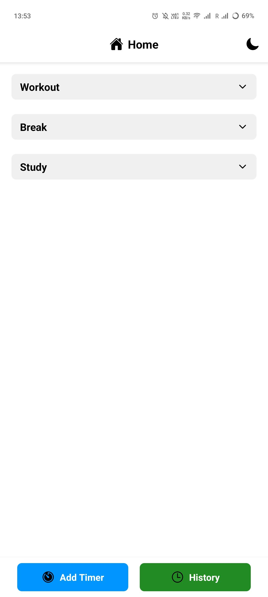
  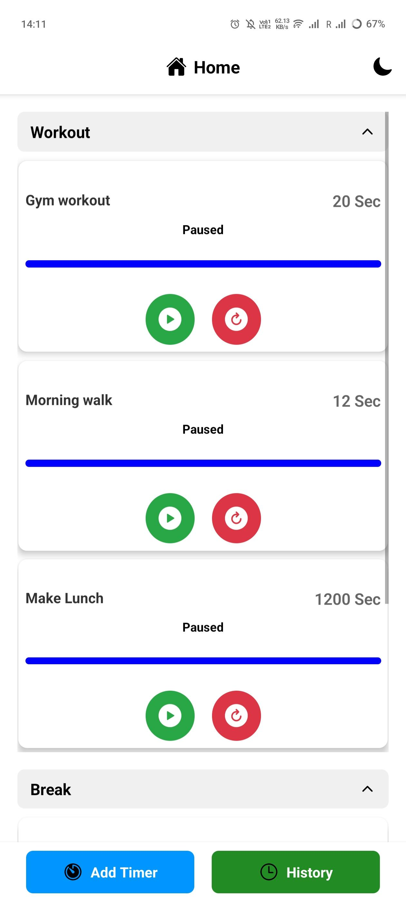
  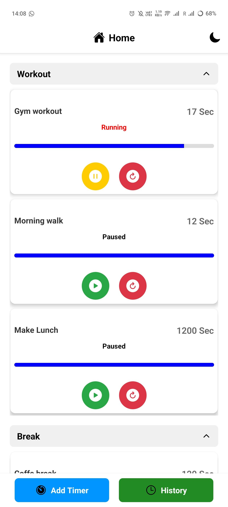
</p>

<p align="center">
  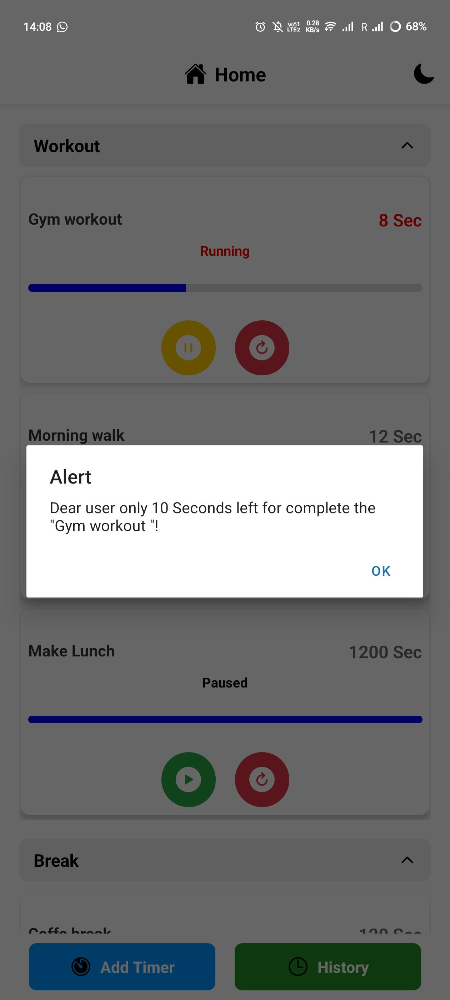
  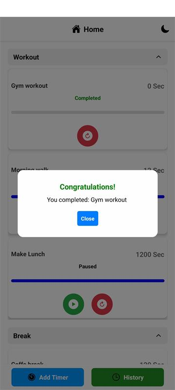
</p>

### History Screen Light Mode
<p align="center">
  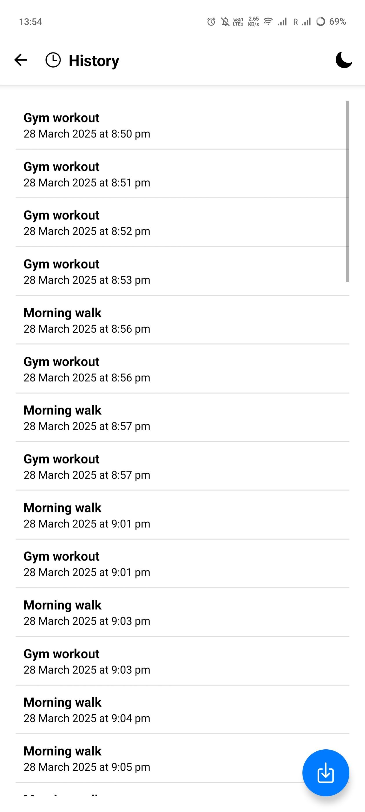
</p>

### Add Timer Screen Light Mode
<p align="center">
  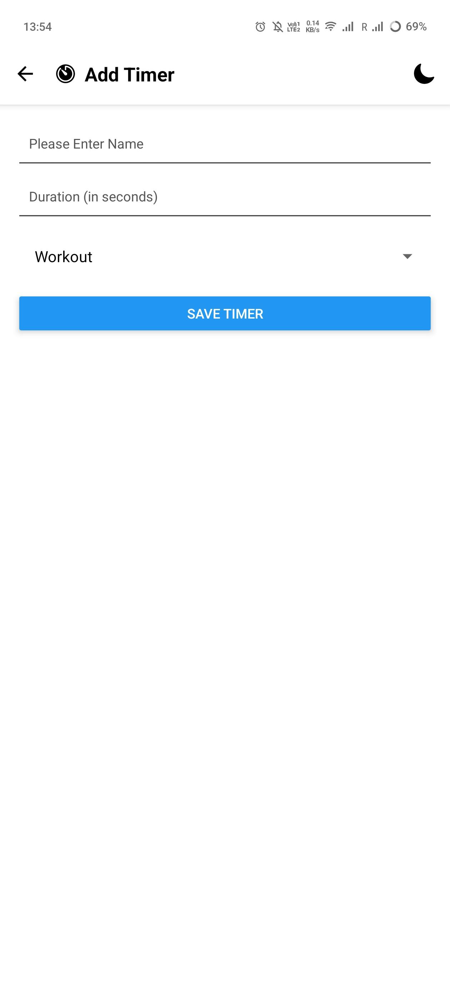
  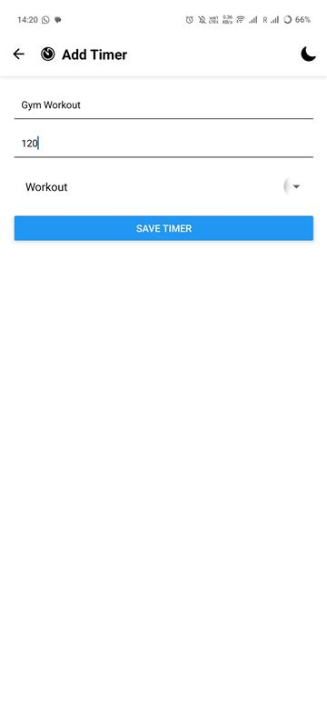
</p>


### Home Screen Dark Mode
<p align="center">
  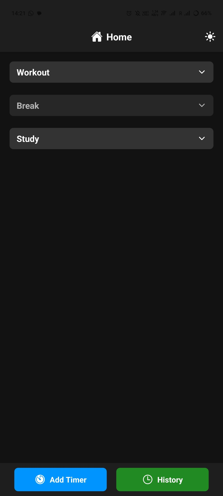
  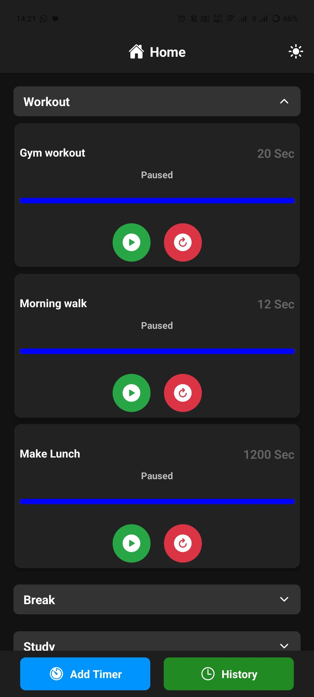
</p>

### History Screen Dark Mode
<p align="center">
  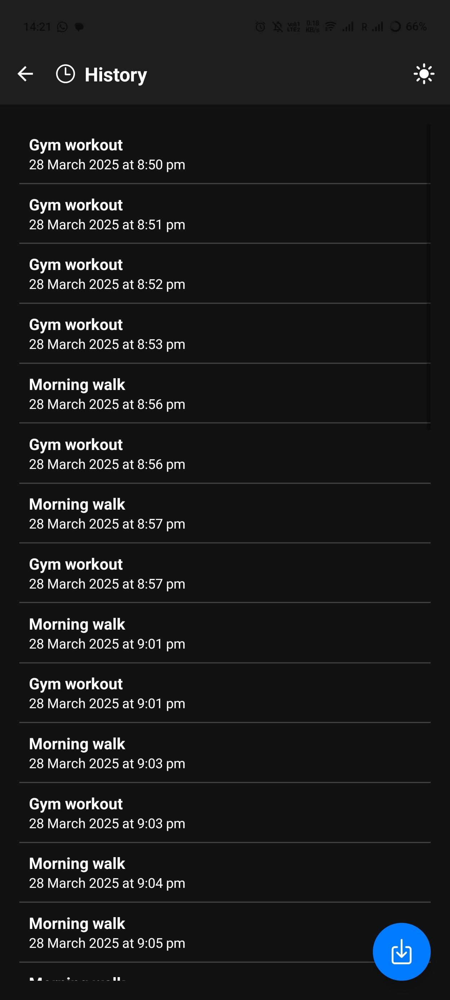
</p>

### Add Timer Screen Dark Mode
<p align="center">
  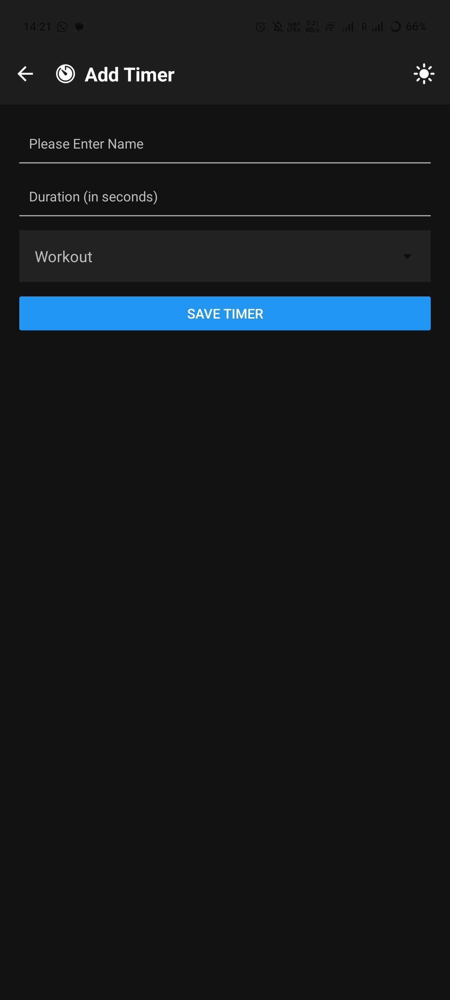
</p>

